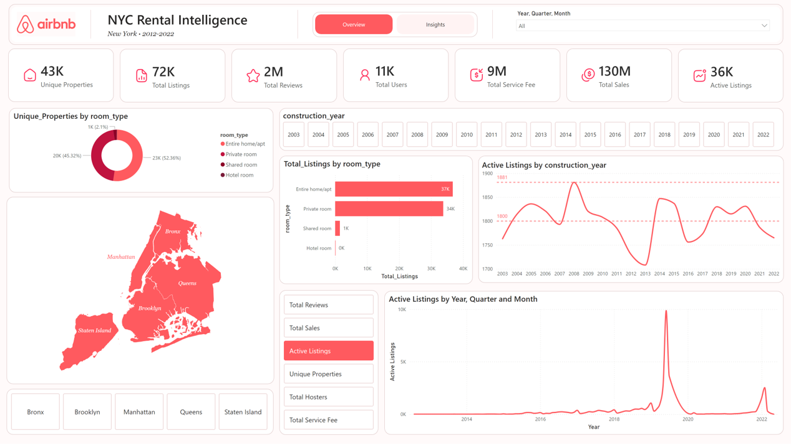
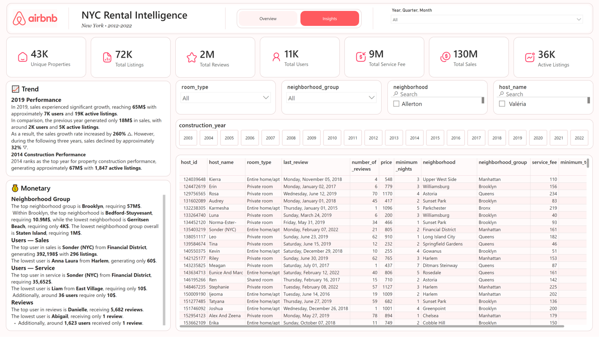

# NYC Rental Intelligence Dashboard

## Overview
An end-to-end Business Intelligence and Data Analysis project built using SQL Server and Power BI to analyze Airbnb NYC rental performance between 2012 and 2022.  

The project focuses on:
- Revenue analysis
- Neighborhood performance
- Host behavior
- Service fee analysis
- Review trends
- Property distribution
- Business insights and storytelling

---

## Dashboard Preview

### Overview Page


### Insights Page


---

## Business Objectives
This project aims to answer several business questions, including:

- Which neighborhood generates the highest revenue?
- Which hosts dominate the platform?
- How did sales evolve over time?
- Which room types perform best?
- What are the most active neighborhoods?
- How are reviews distributed among hosts?
- Which years achieved the highest growth?

---

## Tools & Technologies
- SQL Server
- Power BI
- DAX
- Power Query
- Data Cleaning
- Data Visualization

---

## Key KPIs
| KPI | Value |
|---|---|
| Total Sales | 130M$ |
| Total Service Fee | 9M$ |
| Total Reviews | 2M |
| Total Listings | 72K |
| Active Listings | 36K |
| Unique Properties | 43K |
| Total Users | 11K |

---

# Key Insights

## 📈 Trend Analysis

### 2019 Performance
In 2019, sales experienced significant growth, reaching approximately **65M$** with around **7K users** and **19K active listings**.  

Compared to the previous year, which generated only **18M$** in sales with approximately **2K users** and **5K active listings**, the sales growth rate increased by **260% △**.  

However, during the following three years, sales declined by approximately **32% ▽**.

### 2014 Construction Performance
2014 ranked as the top year for property construction performance, generating approximately **67M$** with **1,847 active listings**.

---

## 💰 Monetary Analysis

### Neighborhood Group Performance
The top neighborhood group is **Brooklyn**, generating approximately **57M$**.  

Within Brooklyn, the leading neighborhood is **Bedford-Stuyvesant**, generating around **10.9M$**, while **Gerritsen Beach** generated only **4K$**.  

The lowest-performing neighborhood group overall is **Staten Island**, generating approximately **1M$**.

### Users — Sales
The top host in sales is **Sonder (NYC)** from the **Financial District**, generating **392,198$** with **296 listings**.  

The lowest-performing host is **Anna Laura** from **Harlem**, generating only **60$**.

### Users — Service Fee
The top host in service fees is **Sonder (NYC)** from the **Financial District**, generating approximately **35,652$**.  

The lowest-performing host is **Liam** from **East Village**, generating only **10$**.  

Additionally, around **36 hosts** generated only **10$** in service fees.

### Reviews
The top host in reviews is **Danielle**, receiving **5,682 reviews**.  

The lowest-performing host is **Abigail**, receiving only **1 review**.  

Additionally, around **1,623 hosts** received only **1 review**.

---

## Data Cleaning & Preparation
The dataset required several preprocessing and cleaning steps, including:
- Removing duplicates
- Handling missing values
- Standardizing neighborhood and host names
- Creating calculated measures using DAX
- Building composite grouping logic for non-unique host names

---

## Project Structure

```text
airbnb-data-analysis/
│
├── dashboard/
│   └── Airbnb.pbix
│
├── sql/
│   ├── cleaning.sql
│   ├── analysis.sql
│   └── kpi_queries.sql
│
├── images/
│   ├── overview.png
│   └── insights.png
│
└── README.md
